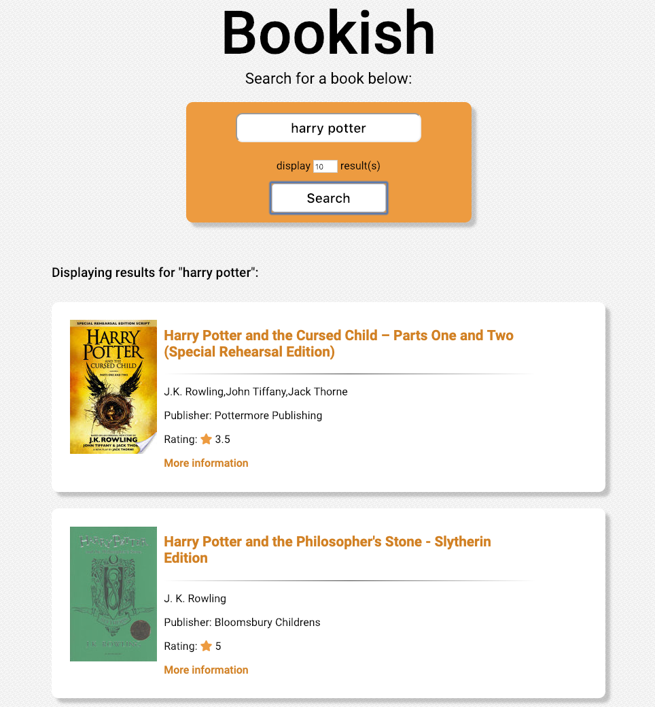

# Bookish - A Book Search Application

- [Bookish - A Book Search Application](#bookish---a-book-search-application)
  - [What is Bookish?](#what-is-bookish)
  - [Preview](#preview)
  - [Application Requirements](#application-requirements)
  - [Install](#install)
  - [Testing](#testing)
      - [To run tests:](#to-run-tests)
  - [Code review feedback](#code-review-feedback)
      - [Security Vunerability](#security-vunerability)
  - [Edge cases considered](#edge-cases-considered)

## What is Bookish?

- A responsive web application, which allows the user to enter a query to search the [Google Books API](https://developers.google.com/books/docs/overview) for books.
- The user can choose to view up to 40 books matching their query.

[View Bookish on Heroku](https://bookish-00.herokuapp.com).

## Preview



## Application Requirements

The application should allow the user to:

- Type in a query and view a list of books matching that query.
- View the following for each book:
  - Title
  - Authors
  - Publishing company
  - Cover image
- Navigate to more information about the book.

## Install

Bookish can be viewed on [Heroku](https://bookish-00.herokuapp.com). Alternatively, it can be run locally:

**Note:** You can download node and npm from [here](https://www.npmjs.com/get-npm), if not already installed.

```
git clone https://github.com/itsellej/js-book-search-app.git
cd js-book-search-app
```

To be able to search for books, create an `.env`file in the root directory, and add your [Google Books API](https://developers.google.com/books/docs/v1/using#APIKey) key, e.g:

```
KEY=39880032123APIKEYetc
```

```
npm install
npm run build
npm start
```

Navigate to `http://localhost:8080` in your browser.

## Testing

The testing library used is [Jest](https://jestjs.io/). Two test suites are included:

1. To test the GoogleBooksAPI class, which makes a request to the Google Books API.
2. To test that the Book Search Data class formats the data received from the Google Books API request.

#### To run tests:

Type `npm run test` in the terminal.

## Code review feedback

#### Security Vunerability

- **Issue:** the app is susceptible to injection attacks. E.g. a query of `Harry Potter&foo=bar&key=12345#` will send a HTTP request with a param called "foo" and a key overwriting all of the params that is specified in the code.
- **Comment:** This is a new concept I'm being introduced to. I believe this may be due to [DOM-based Cross-Site Scripting](https://www.owasp.org/index.php/Testing_for_Cross_site_scripting#Description_of_Cross-site_scripting_Vulnerabilities).
- **Solution:** In the [GoogleBooksAPI](https://github.com/itsellej/js-book-search-app/blob/master/src/google_books_api.js) class, `getSearchResultData()` takes a parameter `query`. This is input from the user. By calling `encodeURIComponent()` on `query`, URL reserved characters are replaced with their UTF-8 encoding. This is done before the API request is made.
  For example, as a result, the query above is encoded to:
  `Harry%20Potter%26foo%3Dbar%26key%3D12345%23`

## Edge cases considered

- If a book cover image is not available, a [placeholder image](https://github.com/itsellej/js-book-search-app/blob/master/dist/assets/img/no-image.png) is displayed. The image is located in `./dist/assets/img/`.

- If the requested information (authors, publisher or rating) is unavailable, _'Author information unavailable', 'Not rated',_ or _'Not available'_ is displayed.

- If a user does not enter a query, or select to display between 1-40 results, an error message displays, and a request to the Google Books API is not actioned.

- Previously, a `mixed content` error displayed in the browser console, due to the Google Books API providing an insecure thumbnail image link (http://). In BookSearchData class, the `httpToHttps` method replaces http:// with https://. As a result, this error no longer displays in the console.

- Displays '_No results found. Please try again._' if the API request returned 0 book items.
